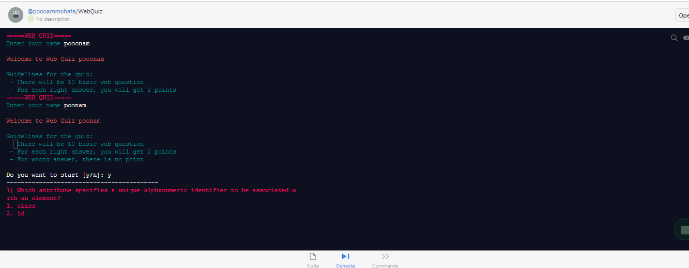
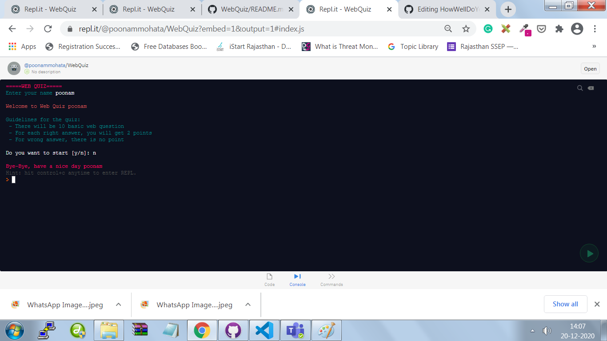

# Web Quiz

This is a cli web quiz app,which asks basic question of html, css, javascript 

# Motivation

The motivation behind creating this project is [neogcamp](https://neog.camp/)

# Tech used

* javascript-NodeJS

# Library used

* [readlineSync](https://www.npmjs.com/package/readline-sync)
* [chalk](https://www.npmjs.com/package/chalk)

# Tools used

* [Repl](https://repl.it/@poonammohata/WebQuiz#index.js)

# Visuals

# Usage

* [Go to this link](https://repl.it/@poonammohata/WebQuiz?embed=1&output=1)
* click on play button
* add your name
* see the question and answer them

